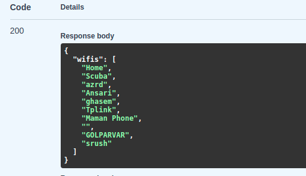
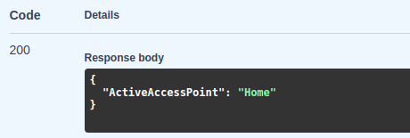

# Search and Connect to WiFis

This project includes some diffrent python files to search and connect to wifis around.
it is useful for using it on some IoT devices like raspberry pi to check its wifis around and connect them.

## First File; api-to-show-wifis:
in this project we used [PyGObject package](https://lazka.github.io/pgi-docs/) to work with devices on machine. 
### Installation:
First we need to install PyGObject and fastapi packages.

_if you had trouble installing PyGObject package from pip, try with:_

```bash
sudo apt install python3-gi python3-gi-cairo gir1.2-gtk-3.0
sudo apt install libgirepository1.0-dev gcc libcairo2-dev pkg-config python3-dev gir1.2-gtk-3.0
```

and then:

``` pip
pip install pycairo
pip install PyGObject
```

for fastapi you can simply run:

``` pip
pip install fastapi
```
and we will use uvicorn to run it, you can use other tools:
``` pip
pip install uvicorn
```

### Usage:
we have two APIs here:
_/Show-WiFis_ and _/get_active_access_point_; the first one will use NM package which stands for network-manager, and gives us access to our devices.
``` python
nmc = NM.Client.new(None)
devs = nmc.get_devices()
```
and we specifically need our WIFI device so:
``` python
dev.get_device_type() == NM.DeviceType.WIFI
```

the output of two APIs will be like this:
#####  API /Show-WiFis


##### API /get_active_access_point



## Second File; connect-to-wifi.py:

This file contains a class with two function run and connection, the command used to search for wifis is:

```bash
sudo iwlist wlp2s0 scan | grep ESSID
```

the command to connect to specefic wifi is:
```bash
nmcli d wifi connect <Name_of_WIFI> password <Pass_of_WIFI>
```


## Contributing
Pull requests are welcome. For major changes, please open an issue first to discuss what you would like to change.

Please make sure to update tests as appropriate.
